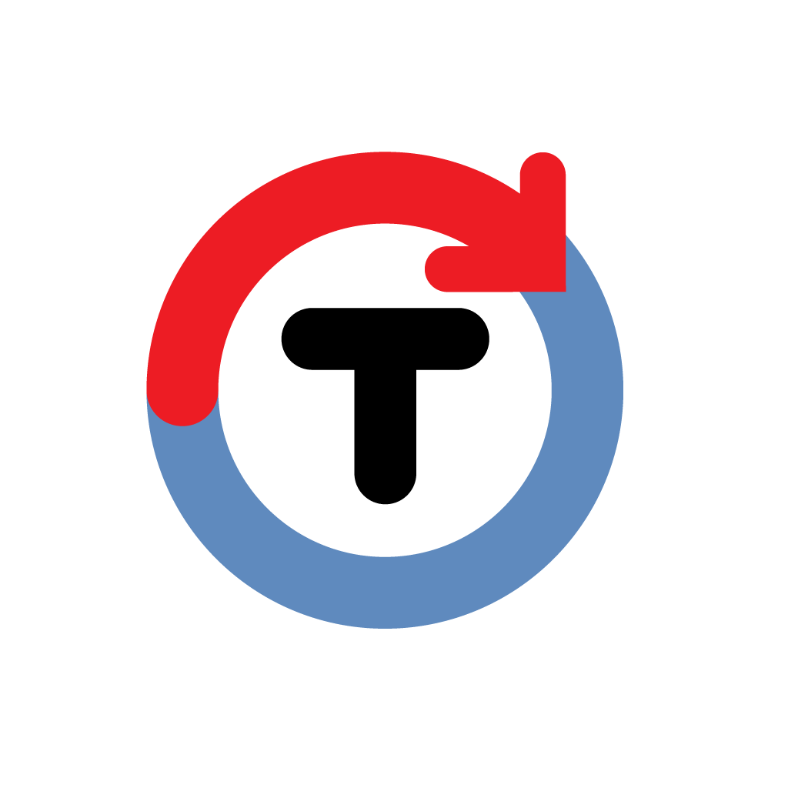

# Time Tracker

Project WIP

## Project setup
```
npm install
```

### Compiles and hot-reloads for development
```
npm run serve
```

### Compiles and minifies for production
```
npm run build
```

### Lints and fixes files
```
npm run lint
```

### Customize configuration
See [Configuration Reference](https://cli.vuejs.org/config/).


<div align="center" id="top"> 
  
</div>

<h1 align="center">Alura Tracker</h1>

<!-- Status -->

<h4 align="center"> 
	🚧  Estudando Vue 🚀 🚧
</h4> 

<hr>

<p align="center">
  <a href="#dart-sobre">Sobre</a> &nbsp; | &nbsp; 
  <a href="#sparkles-funcionalidades">Funcionalidades</a> &nbsp; | &nbsp;
  <a href="#rocket-tecnologias">Tecnologias</a> &nbsp; | &nbsp;
  <a href="#white_check_mark-pré-requisitos">Pré requisitos</a> &nbsp; | &nbsp;
  <a href="#checkered_flag-começando">Começando</a> &nbsp; | &nbsp;
  <a href="#memo-licença">Licença</a> &nbsp; | &nbsp;
  <a href="https://github.com/heliomarpm" target="_blank">Autor</a>
</p>

<br>

## :dart: Sobre ##

Projeto para cadastro e execução de tarefas, criado dentro do curso de [Formação Vue 3 da Alura](https://cursos.alura.com.br/formacao-vuejs3)

## :sparkles: Funcionalidades ##

:heavy_check_mark: Funcionalidade 1: Cadastrar/Editar Tarefas \
:heavy_check_mark: Funcionalidade 2: Cadstrar/Editar Projetos \
:heavy_check_mark: Funcionalidade 3: Cronometrar o Tempo das Tarefas 
## :rocket: Tecnologias ##

As seguintes ferramentas foram usadas na construção do projeto:

- [Node.js](https://nodejs.org/en/)
- [TypeScript](https://www.typescriptlang.org/)
- [VueJs](https://vuejs.org/)
- [Vuex](https://vuex.vuejs.org/ptbr/)
- [Axios](https://axios-http.com/)
- [FortAwesome](https://fortawesome.com/)
- [Bulma](https://bulma.io/)

## :white_check_mark: Pré requisitos ##

Antes de começar :checkered_flag:, você precisa ter o [Git](https://git-scm.com) e o [Node](https://nodejs.org/en/) ou [Docker](https://www.docker.com/) instalados em sua maquina.

## :checkered_flag: Começando ##

```bash
# Clone este repositório
$ git clone https://github.com/heliomarpm/todo-tracker

# Entre na pasta
$ cd todo-tracker

# Instale as dependências
$ npm i

# Para iniciar o projeto
$ npm start
# O app vai inicializar em <http://localhost:8080>

# Compiles and minifies for production
$ npm run build

# Lints and fixes files
$ npm run lint

# -- or -- 

docker-compose up -d --build
# O app vai inicializar em <http://localhost:8080>
```

### Customize configuration
See [Configuration Reference](https://cli.vuejs.org/config/).

<a href="#top">🔝</a>
